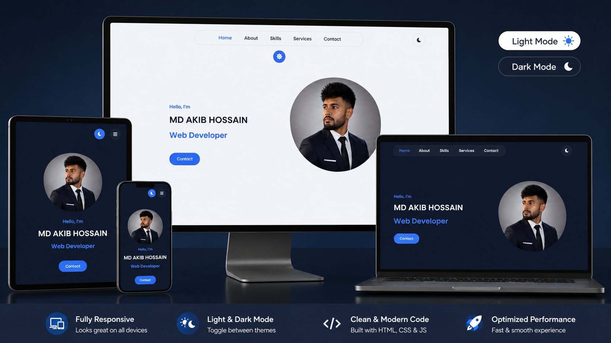

# 🌐 Personal Portfolio Website

Modern Responsive Portfolio Website built using HTML, CSS & JavaScript.

### 🔗 Live Demo

https://akibme.github.io/web/

<p align="center">

</p>


## ✨ Features

- Responsive Design
- Dark / Light Mode
- Smooth Scrolling
- Animated Sections
- Mobile Navigation
- Modern UI
- SEO Friendly
- Fast Loading

- ## 🛠 Technologies

- HTML5
- CSS3
- JavaScript
- Font Awesome
- Responsive Design

- ## Installation

```bash
git clone https://github.com/akibme/web.git
```

Open

```
index.html
```

in your browser.

## 🚀 Live Demo

https://akibme.github.io/web/

## Contact

Email
akib.me.bd@gmail.com

GitHub
https://github.com/akibme

WhatsApp
https://api.whatsapp.com/send?phone=8801701466702

## License

MIT License

git add .
git commit -m "Professional README"
git push origin main
